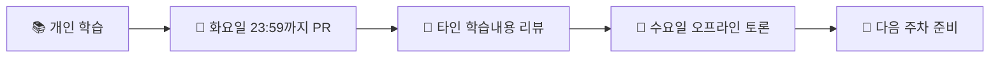

# 🏗️ Clean Architecture Study

로버트 C. 마틴(Uncle Bob)의 **Clean Architecture**를 통해 지속가능하고 유지보수 가능한 소프트웨어 설계 원칙을 학습하는 스터디입니다.

### 🎯 Study Info

| 항목         | 내용                                                                                                            |
| ------------ | --------------------------------------------------------------------------------------------------------------- |
| **도서**     | <a href="https://product.kyobobook.co.kr/detail/S000001033082">클린 아키텍처: 소프트웨어 구조와 설계의 원칙</a> |
| **일정**     | 2025년 8월 25일 ~                                                                                               |
| **모임**     | 매주 수요일 오후 6:30                                                                                           |
| **장소**     | 사내 회의실                                                                                                     |
| **진행방식** | 온라인 정리 → 오프라인 토론                                                                                     |

### 🗓️ Study Schedule

> 추석 연휴는 쉬어가요.

| Week    | Study Period  | PR Deadline      | Learning Scope                         |
| ------- | ------------- | ---------------- | -------------------------------------- |
| Week 1  | 8/25 ~ 9/2    | 9/2 (화) 23:59   | 1-3장 (아키텍처 기초)                  |
| Week 2  | 9/3 ~ 9/9     | 9/9 (화) 23:59   | 4-6장 (패러다임)                       |
| Week 3  | 9/10 ~ 9/16   | 9/16 (화) 23:59  | 7-9장 (SRP, OCP, LSP)                  |
| Week 4  | 9/17 ~ 9/23   | 9/23 (화) 23:59  | 10-11장 (ISP, DIP)                     |
| Week 5  | 9/24 ~ 9/30   | 9/30 (화) 23:59  | 12-14장 (컴포넌트)                     |
| Week 6  | 10/1 ~ 10/7   | 10/7 (화) 23:59  | 15-17장 (아키텍처, 경계)               |
| Week 7  | 10/15 ~ 10/21 | 10/21 (화) 23:59 | 18-20장 (경계, 업무규칙)               |
| Week 8  | 10/22 ~ 10/28 | 10/28 (화) 23:59 | 21-23장 (클린 아키텍처)                |
| Week 9  | 10/29 ~ 11/4  | 11/4 (화) 23:59  | 24-26장 (계층과 경계)                  |
| Week 10 | 11/5 ~ 11/11  | 11/11 (화) 23:59 | 27-29장 (서비스, 테스트)               |
| Week 11 | 11/12 ~ 11/18 | 11/18 (화) 23:59 | 30-32장 (데이터베이스, 웹, 프레임워크) |
| Week 12 | 11/19 ~ 11/25 | 11/25 (화) 23:59 | 33-34장 (사례연구) + 전체 복습         |

## 🔄 How We Study



### 주간 프로세스

1. **📖 개인 학습**: 주차별 지정 분량 읽기
2. **✍️ 내용 정리**: 학습한 내용을 마크다운으로 정리
3. **🔀 PR 제출**: 매주 화요일 23:59:59까지 PR 올리기
4. **👥 오프라인 미팅**: 수요일 1-2시간 토론 및 회고
5. **🔍 리뷰**: 다른 스터디원들의 학습 내용 참고

## 📁 Repository Structure

```
📁 clean-architecture/
├── 📄 README.md                       # 스터디 소개 (현재 파일)
├── 📂 week-1-아키텍처기초/
│   ├── 📝 README.md                   # 주차별 요약 & 회의 기록
│   ├── 📖 seyeong.md                  # 개인 학습 정리
│   ├── 📖 sooyoung.md
│   ├── 📖 ...
│   └── 📖 ...
├── 📂 week-2-패러다임/
│   ├── 📝 README.md
│   └── 📖 개인별 학습 정리 파일들...
├── 📂 week-3-SRP_OCP_LSP/
│   └── 📖 ...
├── 📂 week-4-ISP_DIP/
│   └── 📖 ...
└── 📂 week-N-주제명/
    └── 📖 ...
```

## 📋 Study Rules

### 🎯 참여 원칙

- **적극적 참여**: 매주 정해진 분량을 성실히 학습
- **시간 준수**: 화요일 자정까지 PR 필수 제출
- **사전 공지**: 불참 시 미리 공유하기
- **존중**: 다양한 관점과 학습 스타일 인정

### 📝 학습 공유 방식

- **자유로운 정리**: 본인만의 스타일로 학습 내용 정리
- **질문 환영**: 이해되지 않는 부분은 적극적으로 공유
- **상호 리뷰**: 다른 스터디원의 관점에서 배우기

### 🔧 Git Workflow

```bash
1. Fork this repository
2. Create your branch: git checkout -b week-N-yourname
3. Commit your changes: git commit -m 'Add: Week N study notes'
4. Push to branch: git push origin week-N-yourname
5. Create Pull Request
```

- **PR 규칙**: Fork → PR → Squash Merge
- **리뷰 프로세스**: 스터디 주최자가 확인 후 머지
