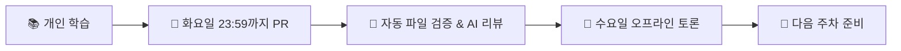

# 🏗️ Clean Architecture Study

로버트 C. 마틴(Uncle Bob)의 **Clean Architecture**를 통해 지속가능하고 유지보수 가능한 소프트웨어 설계 원칙을 학습하는 스터디입니다.

### 🎯 Study Info

| 항목         | 내용                                                                                                            |
| ------------ | --------------------------------------------------------------------------------------------------------------- |
| **도서**     | <a href="https://product.kyobobook.co.kr/detail/S000001033082">클린 아키텍처: 소프트웨어 구조와 설계의 원칙</a> |
| **일정**     | 2025년 8월 25일 ~                                                                                               |
| **모임**     | 매주 수요일 오후 6:30                                                                                           |
| **장소**     | 사내 회의실                                                                                                     |
| **진행방식** | 온라인 정리 → 오프라인 토론                                                                                     |

### 🗓️ Study Schedule

> **12주 완주 목표** - 추석 연휴는 2주 쉬어가요.

| Week    | Meeting          | Learning Scope                         |
| ------- | ---------------- | -------------------------------------- |
| Week 1  | 09/03 (수) 23:59| 1-3장 (아키텍처 기초)                  |
| Week 2  | 09/17 (수) 23:59| 4-6장 (패러다임)                       |
| Week 3  | 09/24 (수) 23:59| 7-9장 (SRP, OCP, LSP)                  |
| Week 4  |10/01 (수) 23:59| 10-11장 (ISP, DIP)                     |
| Week 5  |10/22 (수) 23:59| 12-14장 (컴포넌트)                     |
| Week 6  |10/29 (수) 23:59| 15-17장 (아키텍처, 경계)               |
| Week 7  |11/05 (수) 23:59| 18-20장 (경계, 업무규칙)               |
| Week 8  |11/12 (수) 23:59| 21-23장 (클린 아키텍처)                |
| Week 9  |11/19 (수) 23:59| 24-26장 (계층과 경계)                  |
| Week 10 |11/26 (수) 23:59| 27-29장 (서비스, 테스트)               |
| Week 11 |12/03 (수) 23:59| 30-32장 (데이터베이스, 웹, 프레임워크) |
| Week 12 |12/10 (수) 23:59| 33-34장 (사례연구) + 전체 복습         |

### 🤖 AI 리뷰 시스템

> **Gemini AI가 학습을 도와줘요!**

- 🚀 **자동 리뷰**: PR 제출 시 AI가 즉시 학습 정리 분석
- 💬 **친근한 피드백**: 유머러스하고 따뜻한 톤의 개인화된 리뷰
- ✨ **핵심 요약**: 잘한 점과 추가 관점 제안

```
📝 PR 올리기 → 🤖 AI 분석 → 💬 리뷰 댓글 → 🎉 학습 완료!
```

### 👥 스터디원

<table>
  <tr>
    <td align="center" width="92px">
      <a href="https://github.com/sooyoung159" target="_blank">
        
      </a>
    </td>
    <td align="center" width="92px">
      <a href="https://github.com/youngme92" target="_blank">
        
      </a>
    </td>
    <td align="center" width="92px">
      <a href="https://github.com/jangseyeong" target="_blank">
        
      </a>
    </td>
    <td align="center" width="92px">
      <a href="https://github.com/kamja44" target="_blank">
        
      </a>
    </td>
  </tr>
  <tr>
    <td align="center">
      <a href="https://github.com/sooyoung159" target="_blank">강수영</a>
    </td>
    <td align="center">
      <a href="https://github.com/youngme92" target="_blank">양영모</a>
    </td>
    <td align="center">
      <a href="https://github.com/jangseyeong" target="_blank">장세영</a>
    </td>
    <td align="center">
      <a href="https://github.com/kamja44" target="_blank">전형호</a>
    </td>
  </tr>
</table>

## 🔄 How We Study



### 주간 프로세스

1. **📖 개인 학습**: 주차별 지정 분량 읽기
2. **✍️ 내용 정리**: 학습한 내용을 마크다운으로 정리
3. **🔀 PR 제출**: 매주 화요일 23:59:59까지 PR 올리기
4. **🤖 자동 검증**: GitHub Actions가 학습 파일 존재 여부 자동 체크
5. **🎓 AI 리뷰**: Gemini AI가 학습 정리 내용 분석 및 피드백 제공
6. **👥 오프라인 미팅**: 수요일 1-2시간 토론 및 회고
7. **🔍 리뷰**: 다른 스터디원들의 학습 내용 참고

## 📁 Repository Structure

```
📁 clean-architecture/
├── 📄 README.md                       # 스터디 소개 (현재 파일)
├── 📂 week-1-아키텍처기초/
│   ├── 📝 README.md                   # 주차별 요약 & 회의 기록
│   ├── 📖 seyeong.md                  # 개인 학습 정리
│   ├── 📖 sooyoung.md
│   ├── 📖 ...
│   └── 📖 ...
├── 📂 week-2-패러다임/
│   ├── 📝 README.md
│   └── 📖 개인별 학습 정리 파일들...
├── 📂 week-3-SRP_OCP_LSP/
│   └── 📖 ...
├── 📂 week-4-ISP_DIP/
│   └── 📖 ...
└── 📂 week-N-주제명/
    └── 📖 ...
```

## 📋 Study Rules

### 🎯 참여 원칙

- **적극적 참여**: 매주 정해진 분량을 성실히 학습
- **시간 준수**: 화요일 자정까지 PR 필수 제출
- **사전 공지**: 불참 시 미리 공유하기
- **존중**: 다양한 관점과 학습 스타일 인정

### 📝 학습 공유 방식

- **자유로운 정리**: 본인만의 스타일로 학습 내용 정리
- **질문 환영**: 이해되지 않는 부분은 적극적으로 공유
- **상호 리뷰**: 다른 스터디원의 관점에서 배우기

### 🔧 Git Workflow

```bash
1. Clone this repository
2. Create your branch: git checkout -b week-N-yourname
3. Commit your changes: git commit -m 'Add: Week N study notes'
4. Push to branch: git push origin week-N-yourname
5. Create Pull Request
```

- **PR 규칙**: Clone → PR → Squash Merge
- **자동 검증**: PR 생성 시 학습 파일 자동 체크
- **AI 리뷰**: 제출된 학습 정리에 대한 AI 피드백 제공
- **최종 머지**: 스터디 주최자가 확인 후 머지
