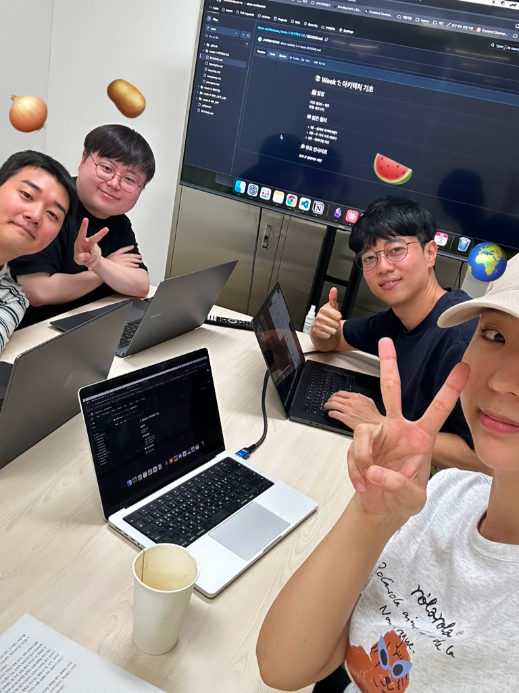

# 📚 Week 1: 아키텍처 기초

## 📅 일정

**모임**: 9/3 (수)

## 📖 읽은 챕터

- 1장 - 설계와 아키텍처란?
- 2장 - 두 가지 가치 이야기
- 3장 - 패러다임 개요

## 💭 주요 인사이트

### 🎯 핵심 논의 주제

**아키텍처의 본질**

- 아키텍처는 "중요하지만 긴급하지 않은" 일 → 우선순위 설정의 어려움
- 설계(고수준)와 디자인(저수준)의 경계가 모호함
- 컴포넌트, 함수 등 작은 단위도 모두 아키텍처의 범주인 것 같음

**개발자 관점의 차이**

- **열정 주니어**: 하나하나 꼼꼼히 정하면서 천천히 개발하고 싶어함 (확신이 서지 않아 신중한 접근 선호)
- **시니어**: 경험을 바탕으로 빠르게 개발하는 것을 선호할 수도 있음 ("이 정도면 충분하다"는 판단으로 속도 중시)
- **갈등 지점**: 시니어의 빠른 개발 요구 vs 주니어의 신중한 검토 욕구
- "개발자는 투쟁해야 한다" - 서로 다른 개발 접근 방식 사이에서 올바른 균형점과 기준점을 찾기 위한 소통과 조율의 필요성

**실무 딜레마와 토론**

- **중복 코드 제거의 딜레마**:

  - 번들 사이즈 vs 가독성/유지보수성의 트레이드오프
  - 팀원과의 정반대 코드 스타일 (어느정도 중복 허용 vs 절대 중복 제거)
  - "번들 사이즈를 줄여봤자 얼마나 줄어드냐" vs 컴퓨터 최적화 관점
  - **실무 기준점**: "조건문이 9개라면 고민해봐야겠다"
  - 목적을 잃어버린 채 무조건 중복 제거하는 함정

- **React 컴포넌트 아키텍처 고민**:

  - **훅 사용 패턴**: 부모에서 훅 호출 후 props 전달 vs 자식에서 직접 사용
    - **실제 사례**: 부모에서 훅을 안 쓰는데 자식 컴포넌트들이 쓰는 경우
  - **mutation 책임**: 삭제 기능을 부모에서 호출하고 delete 메서드를 자식에 넘기는 패턴

- **객체지향과 현실**:
  - 객체를 힙 영역에 저장할 때의 속성 유지 특성 발견
  - 캡슐화 = 제어 흐름의 간접적 전환 + 원본 객체 보존
  - 클래스 사용 시 메서드 호출의 "간접성"에 대한 이해

**협업과 소통**

- **코드 리뷰의 현실**:

  - 기술적 검토보다 **라포 형성**이 우선되는게 좋을 것 같다는..
  - 시간을 정해두고 진행하는 것의 중요성
  - 관계 형성 없이는 효과적인 피드백 불가능할 것 같다는..

- **팀 내 관점 차이**:

  - **프론트엔드 vs 백엔드**: 서로 다른 아키텍처 구조에 대한 고민 어떨지 궁금
  - **개발 스타일 충돌**: 중복 허용 vs 무조건 제거 파의 갈등
  - "누가 맞냐"는 이분법적 사고에서 벗어나기

- **실무 프로젝트의 역설**:
  - 마스터 권한을 무시하기 위한 또 다른 마스터 권한 무시하기 권한 등 복잡한 요구사항
  - 기획 변경에 대한 불확실성과 설계의 딜레마

### 🎯 Action Item

- **TDD 도입**으로 "동작하게 만들고 → 리팩토링" 사이클 정착
- **테스트 코드 우선** 작성으로 설계 품질 향상
- **코드 리뷰 문화** 개선: 시간 설정, 관계 우선 접근법
- 사이드 프로젝트에서 이론 실험 및 적용해보면 좋을 것 같ㄷ자

---

## 📸 1주차 기념

> 🎉 **클린 아키텍처 1주차 무사 완료!**  
> 아키텍처에 대한 철학적 고민부터 실무 딜레마까지, 진솔한 대화를 나눈 뜻깊은 시간이었습니다.  
> 각자의 경험과 관점을 공유하며 더 나은 개발자로 성장하는 여정의 시작! 📚✨

